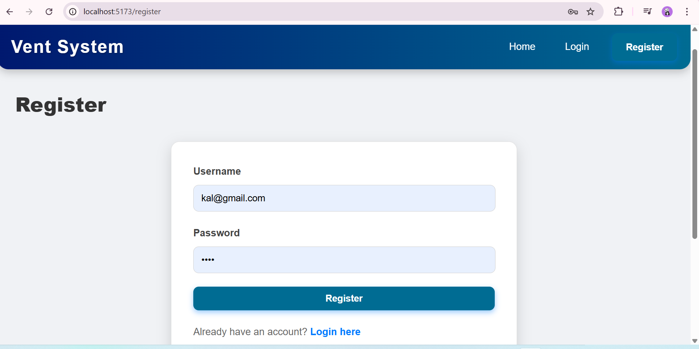
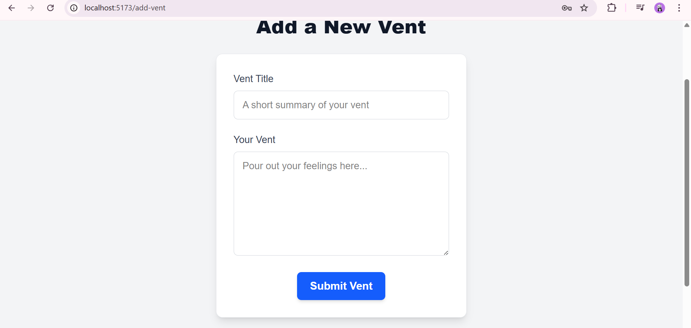

# Vent System: An Anonymous Message Board
# Description
Vent System is an anonymous message board application built with React. It allows users to register, log in, post their vents, and interact with other users' vents by upvoting, downvoting, and replying. Critically, while user accounts are managed for login/deletion purposes, all vents and replies are displayed anonymously to maintain user privacy. All application and user data is persisted directly within the browser's localStorage, simulating a backend database.

# Features Overview
- User Registration & Authentication
- Anonymous Vent Posting
- View All Vents
- Upvote/Downvote Vents
- Reply Feature
- Delete Own Vents

# Setup Instructions
To get this project up and running on your local machine, follow these steps:

- Clone the repository (or set up a new Vite project):
git clone https://github.com/Elshadayyyyy/projects.git
-  Now that you have the project files, navigate to the project directory:
cd vent-system
- install dependancies:
npm install
- Run the application:
npm run dev

The application will then open in your default web browser, most probably at http://localhost:5173.

Accessing Local Storage for Debugging
You can inspect the data stored by the application by opening your browser's Developer Tools, navigating to the "Application" or "Storage" tab, and expanding "Local Storage" for http://localhost:5173. Here you'll find the vents, users, and currentUser data.

# demo

